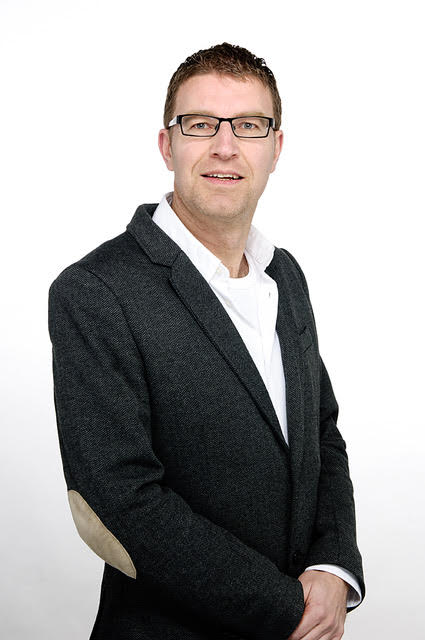

# People Who Liked This Also Liked … A Publication Analysis of Three Decades of Recommender Systems
Today, recommender systems (RS) are a regular feature of our online lives, influencing what we read, watch and listen to, where we go and how we get there, and, sometimes, even the people we meet. In this work, we look back at three decades of recommender systems research to explore (i) the evolution of recommender systems since their inception in the early 1990s, (ii) the health of the research field today, and (iii) its relationship to adjacent fields. To do this, we present a publication analysis of more than 40,000 recommender systems publications by more than 70,000 authors to understand how the field has grown and developed. In doing so, we identify two important RS communities, one based on the research published at mainstream RS venues such as ACM RecSys and its workshops. The other, larger community, encompassing RS work with little or no direct connection to these venues. We analyse these communities to understand their similarities and differences better and the potential to bring them closer together in the future.

# Barry Smyth, School of Computer Science, University College Dublin
[Barry Smyth](https://barrysmyth.me/) (BSc, PhD, Hon. DTech(RGU), MRIA) is a scientist and entrepreneur. He holds the DIGITAL Chair of Computer Science at University College Dublin. He is a member of the Royal Irish Academy and a Founding Director of the Insight Centre for Data Analytics. Barry's research interests include artificial intelligence, machine learning and recommender systems and he co-chaired the 1st ACM Conference on Recommender Systems in 2007. Barry is also an entrepreneur. He co-founded ChangingWorlds and HeyStaks, based on research from his lab, and he currently serves as a board member and/or advisor for several AI-related start-ups.

